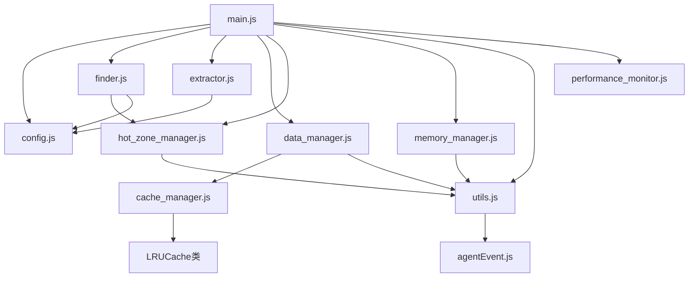
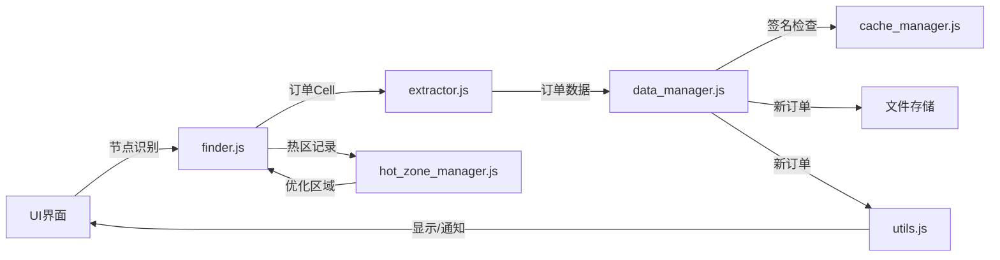
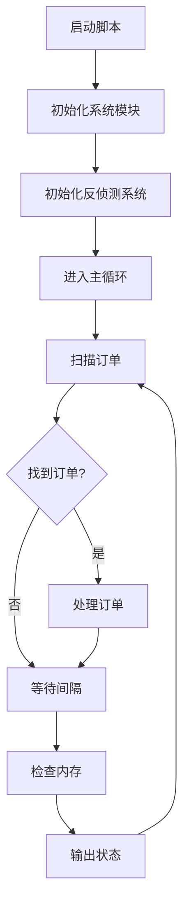
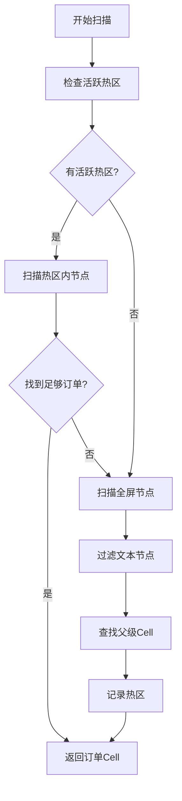
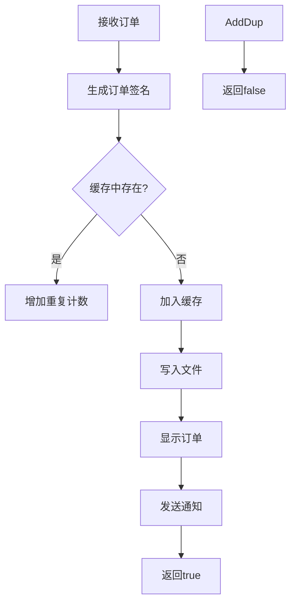

# iOS自动化订单检测系统文档

## 1. 项目架构概览

该项目是一个基于EasyClick iOS脱机版的自动化订单检测系统，主要用于监控和提取货运App中的订单信息。系统采用模块化设计，通过UI节点识别、数据提取、缓存管理和反侦测技术，实现高效稳定的订单数据采集。

### 核心技术栈

- 编程语言: JavaScript
- 运行环境: EasyClick iOS脱机版（免越狱自动化框架）
- 支持系统: iOS 15.0+
- 关键功能: UI节点检测、订单数据提取、LRU缓存、反侦测机制

## 2. 主要目录结构及职责

```
YYYYYYYYYYY/
├── ec_work_config/ - UI资源目录
│   └── ios/
│       ├── ioscolorimage/ - 颜色图像资源
│       └── iosnodeimage/ - 节点图像资源及.uix文件
├── lib.json - 外部库配置
├── obfuscator.json - 混淆器配置
└── YYYYYYYYYYY/ - 主项目代码
    ├── ios-jslibs/ - EasyClick基础库
    │   ├── __require__.js - 模块加载器
    │   ├── agentEvent.js - 设备事件处理
    │   ├── api_ext.js - API扩展
    │   ├── basic.js - 基础功能
    │   ├── device.js - 设备管理
    │   ├── file.js - 文件操作
    │   ├── global.js - 全局函数
    │   ├── http.js - 网络请求
    │   ├── image.js - 图像处理
    │   ├── ui.js - UI界面控制
    │   └── ... - 其他功能库
    └── src/ - 项目源码
        ├── js/ - 业务逻辑代码
        │   ├── main.js - 主程序入口
        │   ├── config.js - 系统配置
        │   ├── finder.js - 订单UI元素查找
        │   ├── extractor.js - 订单数据提取
        │   ├── data_manager.js - 数据管理
        │   ├── hot_zone_manager.js - 热区管理
        │   ├── memory_manager.js - 内存管理
        │   ├── cache_manager.js - 缓存管理
        │   ├── performance_monitor.js - 性能监控
        │   └── utils.js - 工具函数
        ├── layout/ - UI布局
        │   ├── htmljs/ - HTML/JS资源
        │   ├── index.html - 主界面
        │   └── ui.js - UI控制脚本
        ├── plugin/ - 插件目录
        ├── res/ - 资源目录
        └── update.json - 更新配置
```

## 3. 核心模块依赖关系图



## 4. 核心类/模块功能说明

| 模块名称 | 主要职责 | 核心功能/方法 |
|---------|---------|--------------|
| main.js | 程序入口，主循环控制 | initAntiDetection(), mainLogic(), scanAndProcessOrders() |
| config.js | 系统配置管理 | DEBUG_MODE, MAIN_LOOP_INTERVAL_MS, 查找参数配置 |
| finder.js | 查找订单UI元素 | findOrderCells(), filterOrderTextNodes(), findCellsFromTextNodes() |
| extractor.js | 提取订单数据 | collectAllTexts(), extractOrderFromCell(), scoreTextFeatures() |
| data_manager.js | 订单数据管理 | processNewOrder(), writeOrderToFile(), generateOrderSignature() |
| hot_zone_manager.js | 热区优化管理 | recordOrderLocation(), getActiveHotZones(), cleanupInactiveHotZones() |
| memory_manager.js | 内存优化管理 | collectMemoryUsage(), checkAndCleanMemory(), compactDataCache() |
| cache_manager.js | 缓存管理(LRU算法) | LRUCache.get(), LRUCache.put(), LRUCache.containsKey() |
| performance_monitor.js | 性能监控 | recordDetectionDelay(), recordProcessDelay(), generateReport() |
| utils.js | 工具函数集合 | displaySingleOrder(), playNewOrderAlert(), humanTouch(), humanSwipe() |

## 5. 数据流向图



## 6. 核心API接口清单

### 6.1 查找类API

| 接口名称 | 参数 | 返回值 | 描述 |
|---------|-----|-------|-----|
| findOrderCells() | 无 | Cell数组 | 查找屏幕上的订单Cell元素 |
| filterOrderTextNodes(nodes) | nodes: 文本节点数组 | 过滤后的文本节点数组 | 过滤与订单相关的文本节点 |
| findParentCell(node) | node: UI节点 | Cell节点对象 | 查找节点的父级Cell |
| findCellsFromTextNodes(textNodes, processedCellNids) | textNodes: 文本节点数组, processedCellNids: 已处理的nid集合 | Cell数组 | 从文本节点反向查找父级Cell |

### 6.2 数据提取API

| 接口名称 | 参数 | 返回值 | 描述 |
|---------|-----|-------|-----|
| collectAllTexts(node, level) | node: UI节点, level: 递归深度 | 文本数组 | 收集节点及子节点的所有文本 |
| extractOrderFromCell(task) | task: {nid, texts} | orderData对象 | 从Cell提取订单数据 |
| scoreTextFeatures(text) | text: 文本字符串 | 特征评分对象 | 评估文本特征(价格/地址/货物等) |

### 6.3 数据处理API

| 接口名称 | 参数 | 返回值 | 描述 |
|---------|-----|-------|-----|
| processNewOrder(orderData) | orderData: 订单数据对象 | boolean | 处理新订单(检查重复/保存/显示) |
| generateOrderSignature(orderData) | orderData: 订单数据对象 | string | 生成订单唯一签名 |
| writeOrderToFile(orderData) | orderData: 订单数据对象 | void | 将订单数据写入文件 |

### 6.4 优化类API

| 接口名称 | 参数 | 返回值 | 描述 |
|---------|-----|-------|-----|
| hotZoneManager.recordOrderLocation(cell) | cell: Cell元素 | hotZone对象 | 记录订单位置并更新热区 |
| hotZoneManager.getActiveHotZones() | 无 | hotZone数组 | 获取活跃的热区 |
| memoryManager.checkAndCleanMemory() | 无 | boolean | 检查并清理内存 |
| getNextScanInterval() | 无 | number | 计算下一次扫描间隔(添加随机抖动) |

### 6.5 UI交互API

| 接口名称 | 参数 | 返回值 | 描述 |
|---------|-----|-------|-----|
| displaySingleOrder(orderData) | orderData: 订单数据 | void | 在日志中显示订单信息 |
| playNewOrderAlert(orderData) | orderData: 订单数据 | void | 播放新订单提醒 |
| humanTouch(x, y, options) | x: X坐标, y: Y坐标, options: 选项 | boolean | 模拟人类触摸行为 |
| humanSwipe(startX, startY, endX, endY, options) | 起止坐标和选项 | boolean | 模拟人类滑动行为 |

## 7. 常见代码模式和约定

### 7.1 订单数据结构

```javascript
var orderData = {
    nid: "节点ID", 
    timestamp: "ISO格式时间戳", 
    orderType: "即时/预约",
    price: 100.0,  // 价格
    distance: 5.2, // 距离(公里)
    startAddress: "起始地址",
    endAddress: "目的地址",
    vehicleInfo: "车辆信息",
    cargoDetails: "货物详情",
    remarks: "备注信息",
    paymentType: "支付方式",
    rawTexts: "原始文本"
};
```

### 7.2 热区数据结构

```javascript
var hotZone = {
    x1: 0,      // 左上角X
    y1: 0,      // 左上角Y
    x2: 540,    // 右下角X
    y2: 960,    // 右下角Y
    hits: 5,    // 命中次数
    lastHitTime: 1625097600000 // 最后命中时间戳
};
```

### 7.3 反侦测模式

系统使用以下技术实现反侦测：
1. 柏林噪声生成器 - 创建平滑随机序列
2. 高斯随机数生成 - 模拟自然分布
3. 会话行为指纹 - 为每个会话生成独特行为特征
4. 行为进化 - 行为特征随时间缓慢变化
5. 人性化触摸/滑动 - 添加微小随机偏移和自然曲线

### 7.4 LRU缓存实现

使用键值对+访问顺序数组实现高效的LRU(最近最少使用)缓存：
- 键值对快速访问数据
- 数组维护访问顺序
- 定期清理最少使用的项
- 统计命中率和驱逐次数

### 7.5 错误处理模式

```javascript
try {
    // 执行操作
} catch (e) {
    logd("操作类型: 操作失败: " + e);
    // 可选的恢复策略
}
```

## 8. 系统配置参数

| 参数名 | 类型 | 默认值 | 描述 |
|-------|-----|-------|-----|
| DEBUG_MODE | boolean | false | 调试模式，开启时输出更多日志 |
| SECURITY_LEVEL | number | 1 | 安全级别(0:关闭, 1:基础) |
| MAIN_LOOP_INTERVAL_MS | number | 1000 | 主循环扫描间隔(毫秒) |
| SCAN_INTERVAL_BASE | number | 1000 | 基础扫描间隔(毫秒) |
| SCAN_JITTER_PERCENT | number | 20 | 扫描间隔抖动百分比(±20%) |
| ORDER_CELL_SCORE_THRESHOLD | number | 3 | 订单Cell评分阈值 |
| maxHotZones | number | 5 | 最大热区数量 |
| memoryCleanInterval | number | 600000 | 内存清理间隔(10分钟) |

## 9. 详细工作流程

### 9.1 主循环工作流程



### 9.2 订单检测流程



### 9.3 订单数据处理流程



## 10. 技术实现细节

### 10.1 订单查找和提取

订单查找经过多层优化：
1. **热区优先**: 优先扫描过去发现过订单的屏幕区域
2. **关键词过滤**: 使用预定义的关键词对文本节点进行快速筛选
3. **向上查找**: 从文本节点反向追溯找到包含订单完整信息的Cell

订单提取使用规则匹配和特征评分：
1. **文本特征评分**: 对每段文本进行特征评分，判断其是价格/距离/地址/货物信息
2. **正则匹配**: 使用预编译正则表达式提取数值数据
3. **多轮处理**: 先提取关键数据，再处理地址信息，保证信息完整性

### 10.2 LRU缓存优化

LRU缓存用于高效地管理最近检测到的订单：
1. **双重数据结构**: 哈希表+数组存储，哈希表保证O(1)查找，数组维护访问顺序
2. **定期淘汰**: 基于最近最少使用原则，定期淘汰旧订单数据
3. **压缩优化**: 内存管理会定期对缓存进行压缩，减少内存占用
4. **性能统计**: 记录命中率、驱逐次数等统计数据，用于性能评估

### 10.3 反侦测系统

反侦测系统模拟真实人类行为，避免被目标应用识别为自动化脚本：
1. **时间抖动**: 扫描间隔添加±20%的随机抖动
2. **柏林噪声**: 使用柏林噪声生成器创建平滑的随机序列
3. **行为进化**: 会话行为指纹会随时间缓慢变化，避免重复模式
4. **触摸仿真**: 模拟人类触摸的不精确性，添加微小随机偏移
5. **滑动曲线**: 生成自然曲线轨迹，模拟人类滑动手指的行为

### 10.4 热区管理 (v2.0 自适应版)

为了最大化扫描效率并动态适应App的UI变化，系统采用了一套自适应热区管理机制，替代了原有的静态管理方式。

- **动态区域**：热区不再是固定的点或扩展区域，而是直接根据发现的订单`Cell`的**实际边界**来创建。这确保了扫描范围的精确性。

- **动态评分与权重衰减**：
  - 每个热区都有一个动态的`score`（分数）。
  - 分数由一个衰减算法计算得出：`score = hits / (ageInHours + 1)`。
  - 这个公式意味着：
    - **命中次数 (`hits`)** 越多，分数越高。
    - **存在时间 (`ageInHours`)** 越长，分数会自然衰减。
  - 这套机制确保了新的、频繁命中的"热"区会获得高优先级，而陈旧的"冷"区会逐渐失去权重，并最终被淘汰。

- **迭代式智能合并**:
  - 这是新系统的核心。当需要清理时，会触发一个迭代式的合并流程。
  - 系统会反复检查所有热区，只要发现任意两个热区存在重叠，就会将它们**合并成一个更大的热区**，并**重新开始整个检查循环**。
  - 这个过程会一直持续，直到热区列表中再也没有任何相互重叠的区域为止。
  - 这种设计确保了热区集合总是保持最高效、最精简的状态，避免了多个小范围重叠区域造成的资源浪费。

- **核心清理流程 (`cleanupAndMerge`)**:
  1.  **重新计算**所有热区的分数。
  2.  **淘汰**分数低于阈值的"冷"区。
  3.  执行**迭代式智能合并**，直到没有区域可以再合并。
  4.  最后，根据分数从高到低**排序**，并裁剪到数量上限（`maxHotZones`）。

这个自适应系统使订单查找器能够始终聚焦于屏幕上最有可能出现新订单的区域，显著提升了检测效率和对UI变化的鲁棒性。

### 10.5 性能监控

性能监控系统记录和分析系统各个环节的延迟：
1. **检测延迟**: 从开始扫描到检测到订单的时间
2. **处理延迟**: 从检测到订单到完成数据处理的时间
3. **总体延迟**: 检测+处理的总延迟时间
4. **扫描间隔**: 记录实际的扫描间隔，分析系统负载
5. **订单检出率**: 计算有订单扫描次数占总扫描次数的比例

## 11. 系统拓展和优化方向

### 11.1 可能的优化方向

1. **多线程优化**: 
   - 将订单处理移至独立工作线程，减少主线程阻塞
   - 使用线程池并行处理多个订单

2. **智能学习**:
   - 引入简单的机器学习算法，自动优化订单识别规则
   - 基于历史数据自动调整热区位置和大小

3. **远程管理**:
   - 添加远程API接口，支持远程查看和控制
   - 实现订单数据的远程同步和备份

4. **节能模式**:
   - 添加基于时间段的低功耗模式
   - 根据订单出现频率动态调整扫描间隔

5. **自动恢复**:
   - 完善错误处理和自动恢复机制
   - 添加自动重启和状态恢复功能

### 11.2 与其他系统集成

1. **数据导出集成**:
   - CSV/Excel导出接口
   - 数据库存储接口(SQLite/MySQL)

2. **消息通知集成**:
   - 微信/钉钉等消息推送
   - 电子邮件通知

3. **统计分析集成**:
   - 订单数据分析和可视化
   - 趋势预测和报告生成

## 12. 调试与问题排查

### 12.1 已知问题与解决方案

| 问题类型 | 可能原因 | 解决方案 |
|---------|--------|---------|
| 内存泄漏 | 节点资源未释放 | 使用releaseNode(true)定期释放; 降低缓存容量 |
| 漏检订单 | 热区设置不合理 | 增大热区范围; 降低ORDER_CELL_SCORE_THRESHOLD |
| 重复检测 | 签名算法不准确 | 调整generateOrderSignature()算法; 检查时间戳比较 |
| 系统卡顿 | 主线程阻塞 | 减少主循环中的处理逻辑; 提高MAIN_LOOP_INTERVAL_MS |
| 错误提取 | 正则表达式不匹配 | 更新ORDER_REGEX中的模式; 调整scoreTextFeatures算法 |

### 12.2 性能调优参数

| 参数名 | 低负载设置 | 高负载设置 | 影响和说明 |
|-------|-----------|----------|----------|
| MAIN_LOOP_INTERVAL_MS | 1000 | 2000 | 主循环间隔，值越大CPU占用越低 |
| maxHotZones | 3 | 8 | 热区数量，值越大内存占用越高 |
| memoryCleanInterval | 300000 | 900000 | 内存清理间隔，值越小内存占用越低 |
| maxSamples | 50 | 200 | 性能监控样本数，值越小内存占用越低 |
| ORDER_KEYWORDS | 少量关键词 | 更多关键词 | 匹配精度，关键词越多CPU占用越高 | 